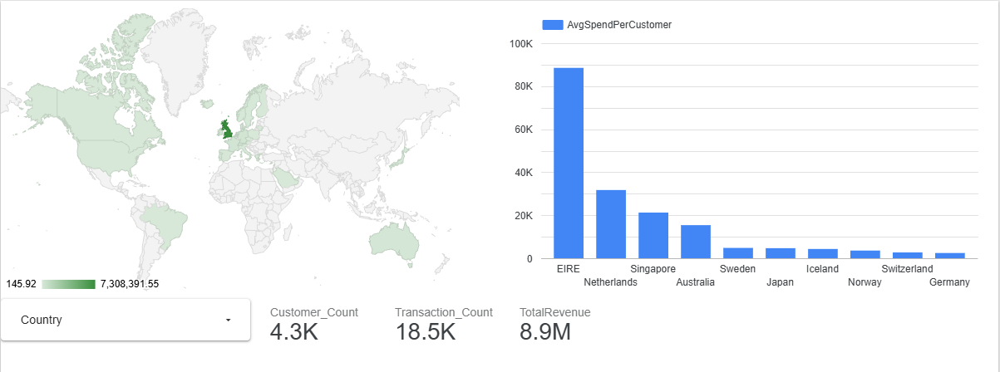

### Retail Data Pipeline: End-to-End Analytics
An end-to-end data engineering project that ingests raw retail data into Google BigQuery, cleans and transforms it using SQL (Medallion Architecture), and visualizes business insights in Looker Studio. The entire ingestion process is containerized for reproducibility.

**🔗 [View Live Dashboard](https://datastudio.google.com/reporting/3e8d49f3-f41c-4d35-9f05-7ac5242acd78)**


## 🏗️ Architecture
The pipeline follows the **Medallion Architecture** to ensure data quality and separation of concerns:
1.  **Bronze (Raw):** Initial data ingestion from CSV to BigQuery via Python.
2.  **Silver (Cleaned):** Data cleaning (removing nulls, filtering invalid quantities/prices) using SQL.
3.  **Gold (Insights):** Aggregated business metrics (Revenue by Country, Average Spend per Customer) for BI.

## 🛠️ Tech Stack
- **Cloud: Google BigQuery
- **Tooling: Docker, Python 3.11
- **Libraries: Pandas, Google Cloud BigQuery
- **Visualization: Looker Studio

```bash
📂 Project Structure
├── data/                # Raw source data (git-ignored)
├── scripts/
│   └── ingest.py        # Python ingestion script for BQ
├── sql/
│   ├── clean_data.sql   # Silver Layer transformations
│   └── insights.sql     # Gold Layer business logic
├── Dockerfile           # Container configuration
├── requirements.txt     # Python dependencies
└── service_account.json # GCP Credentials (git-ignored)
```

## 📋 Prerequisites

- **Docker installed on your machine.
- **A Google Cloud Project with BigQuery enabled.
- **A Service Account JSON key with BigQuery Admin permissions.

### 1. Local Setup
Clone the repository and place your data and credentials in the root directory:

- **Place online_retail.csv in the data/ folder.
- **Place your service_account.json in the root folder.

### 2. Build and Run with Docker
This ensures the ingestion script runs in a standardized environment without needing to install Python libraries locally.

```Bash
# Build the image
docker build -t retail-ingest .

# Run the ingestion script
docker run retail-ingest
```

### 3. SQL Transformations
Once the data is in BigQuery (raw_data.online_retail_raw), run the provided SQL scripts in the BigQuery Console:

- 1. Execute clean_data.sql to create the Silver table.
- 2. Execute insights.sql to create the Gold table.

## 📊 Dashboard Insights
The final Gold layer drives a Looker Studio dashboard highlighting key performance indicators:

- **Revenue Leaders: Identifying top-performing regions.
- **Customer Efficiency: Surfacing high-value markets (e.g., EIRE and Netherlands) driven by wholesale activity.
- **Transactional Trends: Monitoring volume across global markets.

## 🔐 Security & Best Practices

- **Environment Isolation: Docker handles dependency management to avoid "it works on my machine" issues.
- **Data Privacy: .gitignore and .dockerignore are configured to prevent sensitive credentials (service_account.json) and raw data from being committed to version control.
- **SQL Best Practices: Utilized Common Table Expressions (CTEs) and explicit casting for financial accuracy.